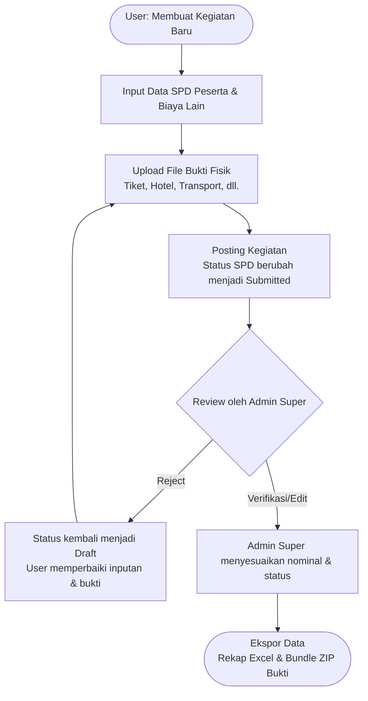

# eSPD - Sistem Manajemen Surat Perjalanan Dinas

eSPD adalah aplikasi berbasis web yang dirancang untuk mengelola dan merekapitulasi data perjalanan dinas (SPD) beserta rincian biaya terkait. Aplikasi ini memungkinkan pencatatan mulai dari tingkat kegiatan hingga rincian biaya per individu, termasuk biaya operasional lain-lain.

## Fitur Utama

1. Manajemen Kegiatan
   - Pencatatan kegiatan atau pelatihan.
   - Penentuan persekot (uang muka) per kegiatan.
   - Ringkasan total pengeluaran dan status sisa/kekurangan persekot.

2. Manajemen Surat Perjalanan Dinas (SPD)
   - Input data peserta (nama, NIP, instansi, dsb.).
   - Perhitungan otomatis komponen biaya (uang harian, tiket, hotel, transportasi, uang representatif, dll.).
   - Pengelompokan data berdasarkan kategori untuk memudahkan verifikasi.
   - Pengunggahan dokumen bukti perjalanan (tiket, kuitansi hotel, dll.) untuk masing-masing peserta.

3. Biaya Operasional Lain-Lain
   - Pencatatan biaya di luar SPD perorangan (seperti konsumsi, cetak spanduk, dll.).
   - Pengunggahan file bukti untuk biaya terkait.

4. Ekspor Data
   - Ekspor rincian SPD ke dalam format Excel (.xlsx).
   - Ekspor file bukti fisik ke dalam format ZIP secara otomatis yang diorganisasikan per folder peserta.

## Alur Kerja

Berikut adalah alur kerja (workflow) utama dalam penggunaan sistem eSPD:



## Persyaratan Sistem

- PHP versi 8.0 atau lebih baru.
- Ekstensi PHP: `pdo`, `pdo_mysql`, `zip`.
- Database MySQL atau MariaDB.

## Instalasi dan Konfigurasi

1. Clone repositori ini ke dalam direktori server lokal (misalnya `htdocs` atau `/var/www/html`).
   ```bash
   git clone <url-repositori> espd
   cd espd
   ```

2. Konfigurasi Lingkungan (Environment)
   - Salin file konfigurasi lingkungan jika belum ada.
   - Buat file `.env` di direktori utama (root) aplikasi.
   - Isi file `.env` dengan format berikut:
     ```env
     MYSQL_HOST=127.0.0.1
     MYSQL_PORT=3306
     MYSQL_DB=nama_database_anda
     MYSQL_USER=username_database
     MYSQL_PASS=password_database
     ```

3. Inisialisasi Database
   - Aplikasi akan otomatis mencoba membuat tabel yang diperlukan jika database sudah tersedia dan pengguna database memiliki hak akses yang cukup (memanfaatkan skema dari `config/schema_mysql.sql`).
   - Secara default, aplikasi menyediakan akun akses:
     - Username: admin
     - Password: admin123

4. Konfigurasi Direktori
   - Pastikan direktori `uploads/` memiliki hak akses tulis (write permissions) dari web server agar pengunggahan dokumen berjalan lancar.

5. Menjalankan Aplikasi
   - Akses melalui web server biasa (Apache/Nginx) atau gunakan PHP built-in server:
     ```bash
     php -S localhost:8000
     ```

## Struktur Direktori

- `api/`       : Endpoint backend untuk memproses data (JSON API).
- `assets/`   : Aset statis seperti CSS dan JavaScript.
- `config/`   : Konfigurasi sistem dan definisi skema database.
- `includes/` : File pembantu (helpers), autentikasi, dan logika ekspor Excel/ZIP.
- `pages/`    : Antarmuka pengguna (UI) dan logika tampilan (dashboard, daftar kegiatan, daftar SPD, detail SPD).
- `uploads/`  : Direktori penyimpanan dokumen bukti fisik yang diunggah pengguna.

## Struktur Database

Sistem eSPD menggunakan beberapa tabel utama dalam database relasional:

- **`users`**: Menyimpan data autentikasi pengguna dan role (Admin Super, user biasa).
- **`kegiatan`**: Menyimpan data utama acara/kegiatan dinas, nomor surat tugas (ST), dan pagu persekot (uang muka).
- **`spd`**: Tabel transaksi utama yang menyimpan rincian perjalanan dinas per orang (terhubung ke tabel `kegiatan`). Berisi informasi lengkap dari identitas, biaya tiket, hotel, transportasi, hingga perhitungan total biaya dan status (Draft, Submitted, dll).
- **`spd_files`**: Menyimpan metadata file bukti fisik perjalanan (tiket, kuitansi hotel, dll.) yang diunggah untuk masing-masing peserta.
- **`kegiatan_biaya_lain`**: Menyimpan rincian biaya operasional ekstra di tingkat kegiatan (di luar rincian peserta) beserta file buktinya.
- **`audit_logs`**: Menyimpan riwayat aktivitas pengguna (log) di dalam sistem untuk keperluan pemantauan dan jejak audit (audit trail).

## Keamanan

Aplikasi menggunakan autentikasi berbasis sesi. Pastikan environment production menggunakan HTTPS untuk mencegah penyadapan sesi. File bukti perorangan dan kegiatan diakses melalui endpoint khusus untuk memastikan perlindungan dokumen terhadap akses publik secara langsung.
