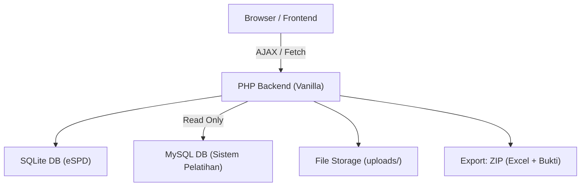

# eSPD — Sistem Pengisian Surat Perintah Perjalanan Dinas Online

Aplikasi PHP vanilla + SQLite untuk mengelola pengisian form SPD secara digital, menggantikan proses manual via Excel spreadsheet ([SPD TOTAL Sorong.xlsx](file:///Users/muhammadyogaprabowo/Documents/01%20PROJECTS/PHP/eSPD/SPD%20TOTAL%20Sorong.xlsx)). Data personel diambil dari database MySQL yang sama dengan [pengajar_api.php](file:///Users/muhammadyogaprabowo/Documents/01%20PROJECTS/R/Sistem%20Pelatihan/php/api/pengajar_api.php) agar konsisten.

## User Review Required

> [!IMPORTANT]
> **Koneksi Database Ganda**: Aplikasi akan menggunakan **SQLite** sebagai database utama eSPD (untuk data SPD, file upload, dll) dan membaca data orang/pengajar langsung dari **MySQL** `Sistem Pelatihan` yang sudah ada via `.env`. Apakah pendekatan ini sesuai, atau lebih baik data orang di-sync/copy ke SQLite?

> [!WARNING]
> **Tanpa Authentication Mandiri**: Rencana awal menggunakan session-based auth sederhana (mirip [auth.php](file:///Users/muhammadyogaprabowo/Documents/01%20PROJECTS/R/Sistem%20Pelatihan/php/includes/auth.php) di Sistem Pelatihan), bukan SSO. User/password disimpan di tabel `users` SQLite.

> [!IMPORTANT]
> **Kolom Excel SPD**: Berdasarkan analisis spreadsheet, ada **89+ kolom** yang dikelompokkan menjadi beberapa bagian. Kolom-kolom yang punya formula (misal total biaya) akan di-compute otomatis. Apakah ada kolom yang harus dihilangkan atau ditambah?

## Open Questions

1. **Apakah data orang yang ditugasi terbatas pada tabel `pengajar`**, atau ada sumber lain (misal peserta pelatihan, pegawai umum)?
2. **Tingkat akses**: Apakah semua user bisa membuat SPD, atau hanya admin/PPK? Siapa saja role-nya?
3. **Export Excel**: Format output Excel harus persis sama dengan template yang ada, atau boleh disesuaikan agar lebih rapi?

---

## Arsitektur Aplikasi



---

## Proposed Changes

### Database Layer

#### [NEW] [database.php](file:///Users/muhammadyogaprabowo/Documents/01%20PROJECTS/PHP/eSPD/config/database.php)
- **SQLite** connection singleton (`espd.sqlite`) — database utama eSPD
- **MySQL** read-only connection ke `Sistem Pelatihan` (untuk ambil data `pengajar`)
- Menggunakan `.env` loader yang sama dengan pattern di [database.php](file:///Users/muhammadyogaprabowo/Documents/01%20PROJECTS/R/Sistem%20Pelatihan/php/config/database.php)
- Helper: `db_query()`, `db_execute()`, `db_last_id()` untuk SQLite
- Helper: `db_mysql_query()` untuk read-only MySQL

#### [NEW] [schema.sql](file:///Users/muhammadyogaprabowo/Documents/01%20PROJECTS/PHP/eSPD/config/schema.sql)
Skema tabel SQLite:

```sql
-- Tabel users untuk autentikasi
CREATE TABLE IF NOT EXISTS users (
    id INTEGER PRIMARY KEY AUTOINCREMENT,
    username TEXT NOT NULL UNIQUE,
    password TEXT NOT NULL,
    display_name TEXT NOT NULL,
    role TEXT NOT NULL DEFAULT 'user',  -- admin, ppk, bendahara, user
    created_at TEXT DEFAULT (datetime('now'))
);

-- Tabel kegiatan/pelatihan sebagai induk SPD
CREATE TABLE IF NOT EXISTS kegiatan (
    id INTEGER PRIMARY KEY AUTOINCREMENT,
    nama_kegiatan TEXT NOT NULL,
    nomor_st TEXT,           -- Nomor Surat Tugas
    tanggal_st TEXT,         -- Tanggal Surat Tugas
    perihal_st TEXT,         -- Perihal Surat Tugas
    kota_tujuan TEXT,
    created_at TEXT DEFAULT (datetime('now')),
    updated_at TEXT DEFAULT (datetime('now'))
);

-- Tabel SPD utama (1 baris per orang per kegiatan)
CREATE TABLE IF NOT EXISTS spd (
    id INTEGER PRIMARY KEY AUTOINCREMENT,
    id_kegiatan INTEGER NOT NULL,
    id_pengajar INTEGER,         -- FK ke MySQL pengajar.id (nullable, bisa manual input)

    -- Identitas (cache dari MySQL atau manual input)
    no_sppd TEXT,
    tgl_sppd TEXT,
    nama TEXT NOT NULL,
    nip TEXT DEFAULT '',
    golongan TEXT DEFAULT '',
    pangkat TEXT DEFAULT '',
    jabatan TEXT DEFAULT '',
    instansi TEXT DEFAULT '',

    -- Perjalanan
    kota_asal TEXT,
    kota_tujuan TEXT,
    tiba_di TEXT,
    tgl_mulai TEXT,
    tgl_akhir TEXT,
    alat_angkut TEXT DEFAULT '',

    -- Tiket
    tiket_pp TEXT DEFAULT '',         -- Keterangan tiket
    tiket_berangkat REAL DEFAULT 0,
    tiket_pulang REAL DEFAULT 0,

    -- Uang Harian Kota 1
    uh_jml_hari INTEGER DEFAULT 0,
    uh_per_hari REAL DEFAULT 0,

    -- Uang Harian Kota 2
    uh2_jml_hari INTEGER DEFAULT 0,
    uh2_per_hari REAL DEFAULT 0,

    -- Uang Harian Kota 3
    uh3_jml_hari INTEGER DEFAULT 0,
    uh3_per_hari REAL DEFAULT 0,

    -- Uang Harian Fullboard
    uh_fullboard_per_hari REAL DEFAULT 0,
    uh_fullboard_jml_hari INTEGER DEFAULT 0,

    -- Hotel (max 6 hotel berbeda)
    tarif_maks_hotel REAL DEFAULT 0,
    hotel1_tarif REAL DEFAULT 0, hotel1_hari INTEGER DEFAULT 0,
    hotel2_tarif REAL DEFAULT 0, hotel2_hari INTEGER DEFAULT 0,
    hotel3_tarif REAL DEFAULT 0, hotel3_hari INTEGER DEFAULT 0,
    hotel4_tarif REAL DEFAULT 0, hotel4_hari INTEGER DEFAULT 0,
    hotel5_tarif REAL DEFAULT 0, hotel5_hari INTEGER DEFAULT 0,
    hotel6_tarif REAL DEFAULT 0, hotel6_hari INTEGER DEFAULT 0,

    -- Penginapan DPR (Daftar Pengeluaran Riil)
    dpr_tarif_hotel REAL DEFAULT 0,
    dpr_malam_hotel INTEGER DEFAULT 0,
    dpr_koefisien REAL DEFAULT 0.3,
    dpr_biaya_penginapan REAL DEFAULT 0,

    -- Transport DPR
    transport_pp REAL DEFAULT 0,
    transport_ke_bandara REAL DEFAULT 0,
    transport_bandara_tujuan REAL DEFAULT 0,
    transport_tujuan_bandara REAL DEFAULT 0,
    transport_bandara_kedudukan REAL DEFAULT 0,
    transport_kedudukan_tujuan REAL DEFAULT 0,

    -- Test Covid
    covid_berangkat REAL DEFAULT 0,
    covid_pulang REAL DEFAULT 0,
    covid_tanpa_bukti REAL DEFAULT 0,

    -- Komponen Transportasi dengan Bukti
    biaya_tol REAL DEFAULT 0,
    biaya_taksi REAL DEFAULT 0,
    biaya_bensin REAL DEFAULT 0,
    biaya_riil_lainnya REAL DEFAULT 0,

    -- Uang Representatif
    uang_representatif REAL DEFAULT 0,
    uang_representatif_hari INTEGER DEFAULT 0,

    -- Tingkat Perjalanan Dinas
    tingkat_perjadin TEXT DEFAULT '',

    -- Data Rekening
    no_rekening TEXT DEFAULT '',
    bank TEXT DEFAULT '',
    nama_rekening TEXT DEFAULT '',

    -- Administrasi
    tgl_dok_diterima TEXT,
    tgl_rincian_spd TEXT,
    pengajuan_up_ls TEXT DEFAULT '',
    tgl_pengajuan TEXT,
    tgl_pembayaran TEXT,
    persekot REAL DEFAULT 0,

    -- Akuntansi / Routing
    akun TEXT DEFAULT '',
    no_routing TEXT DEFAULT '',
    pic TEXT DEFAULT '',
    bendahara TEXT DEFAULT '',
    ppk TEXT DEFAULT '',
    unit TEXT DEFAULT '',

    -- Metadata
    status TEXT DEFAULT 'draft',   -- draft, submitted, verified, paid
    catatan TEXT DEFAULT '',
    created_at TEXT DEFAULT (datetime('now')),
    updated_at TEXT DEFAULT (datetime('now')),

    FOREIGN KEY (id_kegiatan) REFERENCES kegiatan(id)
);

-- File bukti perjalanan
CREATE TABLE IF NOT EXISTS spd_files (
    id INTEGER PRIMARY KEY AUTOINCREMENT,
    id_spd INTEGER NOT NULL,
    kategori TEXT NOT NULL,    -- tiket, hotel, transport, covid, bukti_lain
    nama_file TEXT NOT NULL,
    nama_asli TEXT NOT NULL,   -- Nama file original
    ukuran INTEGER DEFAULT 0,
    mime_type TEXT DEFAULT '',
    created_at TEXT DEFAULT (datetime('now')),
    FOREIGN KEY (id_spd) REFERENCES spd(id) ON DELETE CASCADE
);
```

---

### Backend — Config & Includes

#### [NEW] [.env](file:///Users/muhammadyogaprabowo/Documents/01%20PROJECTS/PHP/eSPD/.env)
```env
# MySQL Sistem Pelatihan (read-only, untuk data pengajar)
MYSQL_HOST=127.0.0.1
MYSQL_PORT=3306
MYSQL_DB=sistem_pelatihan
MYSQL_USER=root
MYSQL_PASS=

# SQLite (default, auto-create)
SQLITE_PATH=data/espd.sqlite
```

#### [NEW] [includes/helpers.php](file:///Users/muhammadyogaprabowo/Documents/01%20PROJECTS/PHP/eSPD/includes/helpers.php)
- Reuse utilitas dari Sistem Pelatihan: `json_response()`, `json_body()`, `h()`, `format_rupiah()`, `safe_filename()`
- Tambahan helper SPD-specific: computed totals (uang harian total, hotel total, grand total)

#### [NEW] [includes/auth.php](file:///Users/muhammadyogaprabowo/Documents/01%20PROJECTS/PHP/eSPD/includes/auth.php)
- Session-based auth, pattern sama dengan [auth.php](file:///Users/muhammadyogaprabowo/Documents/01%20PROJECTS/R/Sistem%20Pelatihan/php/includes/auth.php)

#### [NEW] [includes/xlsx_export.php](file:///Users/muhammadyogaprabowo/Documents/01%20PROJECTS/PHP/eSPD/includes/xlsx_export.php)
- Fungsi generate XLSX dari data SPD (menggunakan `ZipArchive` + XML, pattern dari [helpers.php:output_xlsx_template](file:///Users/muhammadyogaprabowo/Documents/01%20PROJECTS/R/Sistem%20Pelatihan/php/includes/helpers.php#L291-L400))
- Fungsi generate ZIP berisi XLSX + semua file bukti terlampir

---

### Backend — API Endpoints

#### [NEW] [api/kegiatan_api.php](file:///Users/muhammadyogaprabowo/Documents/01%20PROJECTS/PHP/eSPD/api/kegiatan_api.php)
Actions: `list`, `get`, `create`, `update`, `delete`

#### [NEW] [api/spd_api.php](file:///Users/muhammadyogaprabowo/Documents/01%20PROJECTS/PHP/eSPD/api/spd_api.php)
Actions:
- `list` — Daftar SPD per kegiatan
- `get` — Detail 1 SPD
- `create` — Buat SPD baru (pilih orang dari pengajar atau input manual)
- `update` — Update field SPD (inline edit)
- `delete` — Hapus SPD

#### [NEW] `api/biaya_lain_api.php`
Actions:
- `list` — Daftar biaya lain per kegiatan
- `create` — Tambah biaya lain
- `update` — Edit biaya lain
- `delete` — Hapus biaya lain

#### [NEW] [api/pengajar_api.php](file:///Users/muhammadyogaprabowo/Documents/01%20PROJECTS/PHP/eSPD/api/pengajar_api.php)
Actions: `list`, `search` — Read-only proxy ke MySQL Sistem Pelatihan

#### [NEW] [api/file_api.php](file:///Users/muhammadyogaprabowo/Documents/01%20PROJECTS/PHP/eSPD/api/file_api.php)
Actions:
- `upload` — Upload file bukti (tiket, hotel, transport, dll) ke `uploads/{id_spd}/`
- `list` — List file per SPD
- `delete` — Hapus file
- `download` — Download single file

#### [NEW] [api/export_api.php](file:///Users/muhammadyogaprabowo/Documents/01%20PROJECTS/PHP/eSPD/api/export_api.php)
Actions:
- `export_excel` — Download XLSX rekap seluruh SPD per kegiatan
- `export_zip` — Download ZIP (XLSX + semua file bukti) per kegiatan
- `export_spd_single` — Download rincian 1 SPD + file bukti

---

### Frontend — UI

#### [NEW] [index.php](file:///Users/muhammadyogaprabowo/Documents/01%20PROJECTS/PHP/eSPD/index.php)
- SPA-like router: `?page=login|dashboard|kegiatan|spd|detail_spd`
- Login page → Dashboard

#### [NEW] [assets/css/style.css](file:///Users/muhammadyogaprabowo/Documents/01%20PROJECTS/PHP/eSPD/assets/css/style.css)
- Design system: dark mode, glassmorphism, gradients
- Responsive layout, premium aesthetic
- Inline-edit styling, modal styling

#### [NEW] [assets/js/app.js](file:///Users/muhammadyogaprabowo/Documents/01%20PROJECTS/PHP/eSPD/assets/js/app.js)
Core JS module:
- `fetchAPI()` — wrapper Fetch
- `toast()` — notifikasi
- `formatRupiah()` — format IDR di client
- `inlineEdit()` — klik-to-edit cell
- Router / page loader

#### [NEW] [pages/login.php](file:///Users/muhammadyogaprabowo/Documents/01%20PROJECTS/PHP/eSPD/pages/login.php)
- Form login premium

#### [NEW] [pages/dashboard.php](file:///Users/muhammadyogaprabowo/Documents/01%20PROJECTS/PHP/eSPD/pages/dashboard.php)
- Overview: jumlah kegiatan, SPD terbaru, statistik

#### [NEW] [pages/kegiatan.php](file:///Users/muhammadyogaprabowo/Documents/01%20PROJECTS/PHP/eSPD/pages/kegiatan.php)
- CRUD tabel kegiatan
- Klik baris → masuk ke halaman SPD kegiatan tersebut

#### [NEW] [pages/spd_list.php](file:///Users/muhammadyogaprabowo/Documents/01%20PROJECTS/PHP/eSPD/pages/spd_list.php)
- Tabel semua SPD dalam 1 kegiatan
- Tombol: Tambah SPD, Export Excel, Export ZIP
- **Inline edit**: klik cell → langsung edit → auto-save via AJAX
- Status badges (draft, submitted, verified, paid)

#### [NEW] [pages/spd_detail.php](file:///Users/muhammadyogaprabowo/Documents/01%20PROJECTS/PHP/eSPD/pages/spd_detail.php)
- Form lengkap 1 SPD, dikelompokkan per section (accordion/tabs):
  1. **Identitas** — Pilih dari dropdown pengajar (autocomplete) atau input manual
  2. **Perjalanan** — Kota asal, tujuan, tanggal
  3. **Tiket** — Biaya tiket PP
  4. **Uang Harian** — Kota 1, 2, 3, Fullboard
  5. **Hotel** — Sampai 6 hotel berbeda
  6. **Penginapan & Transport DPR** — Daftar Pengeluaran Riil
  7. **Biaya Lain** — Covid, tol, taksi, bensin
  8. **Uang Representatif**
  9. **Data Rekening**
  10. **Administrasi** — Tanggal, PIC, PPK, Bendahara
- Upload file bukti per kategori (drag & drop)
- **Computed fields**: Total uang harian, total hotel, grand total SPD — auto-compute real-time
- Tombol: Simpan, Ubah Status, Export

---

### Fitur Inline Edit

Pada tabel SPD list, setiap cell bisa diklik untuk di-edit langsung:

```
┌─────────────────────────────────────────────────────────────┐
│ Nama         │ NIP            │ Kota Asal │ UH/hari │ Total │
├──────────────┼────────────────┼───────────┼─────────┼───────┤
│ Tunggul Y.   │ 197106...      │ Jayapura  │ 384.000 │ ...   │
│ [klik edit]  │ [klik edit]    │ [klik]    │ [klik]  │ auto  │
└─────────────────────────────────────────────────────────────┘
```

- Klik cell → berubah jadi `<input>` / `<select>`
- `Enter` atau blur → AJAX save → cell kembali jadi teks
- Field formula (total) otomatis re-compute

---

### Export ZIP

Struktur ZIP yang dihasilkan:

```
SPD_[NamaKegiatan]_[Tanggal].zip
├── Rekap_SPD.xlsx              ← Excel lengkap semua kolom
├── Bukti_Perjalanan/
│   ├── 01_Tunggul_Yunianto/
│   │   ├── Tiket_Berangkat.pdf
│   │   ├── Tiket_Pulang.pdf
│   │   ├── Hotel_Kwitansi.jpg
│   │   └── ...
│   ├── 02_Arfin/
│   │   └── ...
│   └── ...
```

---

### Struktur File Project

```
eSPD/
├── index.php                    ← Entry point & router
├── .env                         ← Konfigurasi database
├── .htaccess                    ← URL rewrite / deny data dir
├── config/
│   ├── database.php             ← SQLite + MySQL connections
│   └── schema.sql               ← DDL tabel
├── includes/
│   ├── auth.php                 ← Session-based auth
│   ├── helpers.php              ← Utilitas umum
│   └── xlsx_export.php          ← Export XLSX/ZIP builder
├── api/
│   ├── kegiatan_api.php
│   ├── spd_api.php
│   ├── pengajar_api.php         ← Proxy read dari MySQL
│   ├── file_api.php
│   └── export_api.php
├── pages/
│   ├── login.php
│   ├── dashboard.php
│   ├── kegiatan.php
│   ├── spd_list.php
│   └── spd_detail.php
├── assets/
│   ├── css/style.css
│   └── js/app.js
├── data/                        ← SQLite DB (gitignored)
│   └── espd.sqlite
└── uploads/                     ← File bukti (gitignored)
    └── {id_spd}/
        └── {files...}
```

---

## Migrasi ke MySQL (Future)

Desain dari awal memisahkan DSN di `database.php` agar migrasi cukup:
1. Ganti `sqlite:data/espd.sqlite` → `mysql:host=...;dbname=espd`
2. Konversi DDL dari SQLite syntax ke MySQL (sebagian besar kompatibel)
3. Tidak ada SQLite-specific function yang digunakan

---

## Verification Plan

### Automated Tests
```bash
# 1. Cek syntax PHP
find . -name '*.php' -exec php -l {} \;

# 2. Cek SQLite schema bisa diinisialisasi
php -r "new PDO('sqlite:data/espd.sqlite'); echo 'OK';"

# 3. Run built-in PHP dev server
php -S localhost:8080
```

### Manual Verification
1. Login → Dashboard → Buat Kegiatan → Tambah SPD
2. Pilih pengajar dari dropdown (data dari MySQL)
3. Isi form SPD per section
4. Inline edit di tabel list
5. Upload file bukti (tiket, hotel)
6. Export ZIP → buka XLSX, cek data lengkap
7. Cek semua computed fields (total UH, total hotel, grand total)
